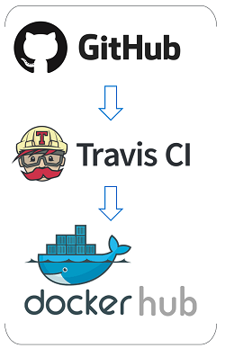
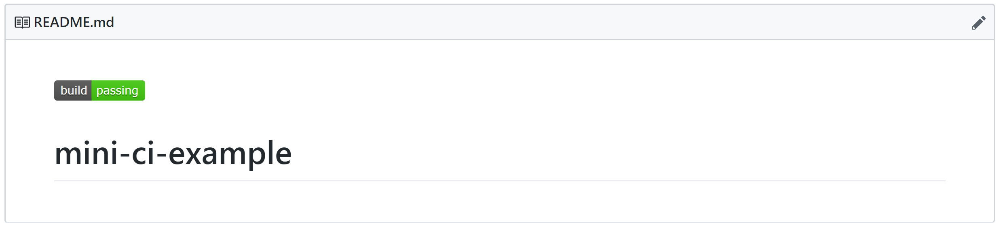

# Exercise 2.1: Setup Continuous Integration

In this exercise, you will set up a *Continuous Integration* (CI) workflow using GitHub as a version control system, Travis CI as a build tool, and DockerHub as artifact repository manager. This workflow will execute the unit tests of the source code and build the code. To trigger it, a change of the codebase has to be performed. 

## Setup



## Requirements

* GitHub account :octocat: 
    <details><summary>Click here for sign-up instructions.</summary>
    <p>

    To sign up:  https://github.com/join

    </p>
    </details>

## Instructions

1. Create a GitHub repository called: `mini-ci-example`

1. Add and commit `main.go` and `main_test.go` to your repository via drag-and-drop.

1. Active Travis CI for your GitHub repository.

    * Follow instructions on: https://docs.travis-ci.com/user/tutorial/#to-get-started-with-travis-ci

1. Create file `.travis.yml` in your repository and copy-paste content from provided `.travis.yml` file. 

1. Trigger a Travis build by a code change, e.g., change "Hello" to "Hi there" in the file `./main.go`

1. Watch Travis executing your tests and building the artifact.

    :mag: What is your observation? 

1. Optional: Add Travis CI status to the README.md: 

    

    * Follow instructions on: https://docs.travis-ci.com/user/status-images/

        ```
        [](https://travis-ci.org/YOUR-GITHUB-ACCOUNT/mini-ci-example)
        ```